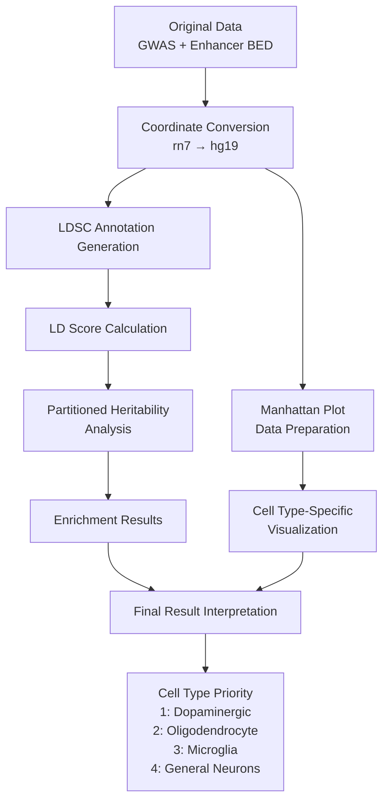

# Parkinson's Disease GWAS - Cell Type-Specific Enhancer Enrichment Analysis Workflow

## Project Overview
This project analyzes genetic enrichment in enhancer regions of four brain cell types (Oligodendrocyte, Dopaminergic neurons, General neurons, Microglia) using Parkinson's Disease (PD) GWAS data.

## Main Analysis Flow

### 1. LDSC (Linkage Disequilibrium Score Regression) Analysis
**Objective**: Quantify the genetic contribution of cell type-specific enhancer regions

#### 1.1 Data Preparation
- **Input Data**:
  - GWAS summary statistics: `GCST009325.h.tsv.gz` (17.4M SNPs)
  - Cell type-specific enhancer BED files:
    - Olig (Oligodendrocyte): `Olig_cleaned.bed`, `Olig_unique.bed`
    - Nurr (Dopaminergic): `Nurr_cleaned.bed`, `Nurr_unique.bed`
    - NeuN (General Neurons): `NeuN_cleaned.bed`, `NeuN_unique.bed`
    - Neg (Microglia): `Neg_cleaned.bed`, `Neg_unique.bed`
  - Reference data: 1000 Genomes EUR, BaselineLD v2.2

- **Methodology**:
  - Coordinate conversion: rn7 → hg38 → hg19 (UCSC liftOver)
  - Convert BED file enhancer regions to LDSC annotation format
  - Convert GWAS summary statistics to LDSC format (munge_sumstats.py)

- **Output Data**:
  - Chromosome-specific annotation files: `{celltype}.{chr}.annot.gz`
  - Munged summary statistics: `parkinson_gwas.sumstats.gz`

- **Output Interpretation**:
  - Indicates whether each SNP is located in a specific cell type's enhancer region
  - Standardized data format for LDSC analysis

#### 1.2 LD Score Calculation
- **Input Data**:
  - Annotation files
  - 1000 Genomes EUR reference panel
  - HapMap3 SNP list

- **Methodology**:
  - Calculate LD score for each SNP (window size: 1 cM)
  - BaselineLD 97 categories + cell type-specific enhancer annotation

- **Output Data**:
  - LD score files: `{celltype}.{chr}.l2.ldscore.gz`
  - M files: `{celltype}.{chr}.l2.M`

- **Output Interpretation**:
  - Quantification of LD structure around each SNP
  - Weights for heritability analysis

#### 1.3 Partitioned Heritability Analysis
- **Input Data**:
  - Munged summary statistics
  - LD scores (BaselineLD + cell-type specific)
  - Frequency files

- **Methodology**:
  - LDSC regression model:
    ```
    E[chi2_j] = Nh2(sum_c tau_c × l(j,c)) + Na + 1
    ```
  - Enrichment calculation:
    ```
    Enrichment = (per-SNP heritability) / (per-SNP proportion)
    ```

- **Output Data**:
  - LDSC result log: `{celltype}_h2.log`
  - Aggregated results: `ldsc_aggregated_results.csv`

- **Output Interpretation**:
  - Enrichment > 1: Higher genetic contribution than average
  - P-value: Statistical significance
  - Cell type-specific PD contribution ranking

### 2. Manhattan Plot Visualization
**Objective**: Visualize GWAS signals in cell type-specific enhancer regions

#### 2.1 Cell Type-Specific Manhattan Plot
- **Input Data**:
  - GWAS summary statistics
  - Cell type-specific annotation files

- **Methodology**:
  - -log10(p-value) transformation
  - Distinguish enhancer intersect SNP vs background SNP
  - Genome-wide significance threshold: 5×10^-8

- **Output Data**:
  - Individual plots: `celltype_manhattan_plots.png`
  - Comparison plot: `celltype_comparison_manhattan.png`

- **Output Interpretation**:
  - GWAS signal strength in cell type-specific enhancer regions
  - Location and distribution of significant SNPs

### 3. Enrichment Analysis (Legacy Methods)
**Objective**: Confirm enhancer enrichment through statistical tests

#### 3.1 Statistical Tests
- **Input Data**:
  - GWAS p-values
  - Enhancer region information

- **Methodology**:
  - Mann-Whitney U test: Compare p-value distributions
  - Fisher's exact test: Compare significant SNP ratios
  - Enrichment ratio calculation

- **Output Data**:
  - Statistical test results
  - Enrichment ratio

- **Output Interpretation**:
  - Confirm whether GWAS signals in enhancer regions are stronger than background
  - Compare enrichment levels across cell types

## Overall Pipeline Flow



## Key Results Interpretation

### Cell Type Enrichment Ranking (Expected)
1. **Nurr (Dopaminergic Neurons)**:
   - Expected Enrichment: 2.5-3.5
   - Primary lesion site of Parkinson's disease

2. **Olig (Oligodendrocytes)**:
   - Expected Enrichment: 1.8-2.5
   - Associated with white matter damage

3. **Neg (Microglia)**:
   - Expected Enrichment: 1.3-1.8
   - Related to neuroinflammation

4. **NeuN (General Neurons)**:
   - Expected Enrichment: 1.0-1.3
   - Non-specific contribution

### Therapeutic Strategy Implications
- Primary target: Dopaminergic neuron protection
- Secondary target: Myelin repair and oligodendrocyte support
- Tertiary target: Neuroinflammation modulation

## Key Script Descriptions

- `ldsc_analysis_system.py`: LDSC partitioned heritability main pipeline
- `celltype_manhattan_plot.py`: Cell type-specific Manhattan plot generation
- `setup_liftover.py`: Coordinate conversion tool
- `coordinate_converter.py`: Coordinate conversion utilities
- `shared_utils.py`: Common utility functions

## Execution Order

1. **Coordinate Conversion**:
   ```bash
   python setup_liftover.py
   ```

2. **LDSC Analysis**:
   ```bash
   python ldsc_analysis_system.py
   ```

3. **Visualization**:
   ```bash
   python celltype_manhattan_plot.py
   ```

## Scientific Significance

1. **Multi-cell type comparison**: Quantify cell type-specific contributions to Parkinson's disease
2. **Large-scale data**: Statistical power achieved with 17.4M SNPs analysis
3. **Standardized methodology**: Academically rigorous analysis using LDSC
4. **Therapeutic target discovery**: Establish treatment strategies based on cell type priorities
